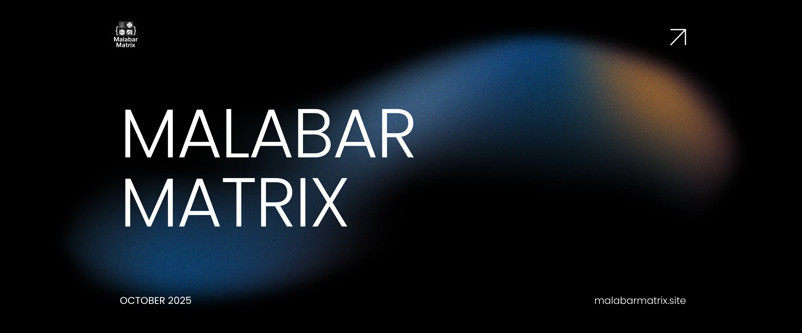

# MalabarMatrix

#
[](https://malabarmatrix.site) [](LICENSE)

A creative engineering collective building user-centric web & software solutions. At **Malabar Matrix**, we fuse aesthetic design with scalable engineering to build intuitive products that solve real problems.

---

## Table of Contents

- [About](#about)  
- [Features & Projects](#features--projects)  
- [Tech Stack](#tech-stack)  
- [Getting Started](#getting-started)  
- [Folder Structure](#folder-structure)  
- [How to Contribute](#how-to-contribute)  
- [License](#license)  
- [Contact](#contact)

---

## About

We are a team of software engineers, UI/UX designers, product strategists, tech mentors, innovators, problem solvers, minimalists, and technology enthusiasts. We believe in:

- **User-first design** — experiences that feel intuitive  
- **Clean, maintainable code**  
- **Continuous learning & iteration**  
- Building tools that help students, startups, and small businesses thrive

On our site, you’ll see blog articles, open-source project highlights, and development tooling we use internally. :contentReference[oaicite:0]{index=0}

---

## Features & Projects

Here are some of our active or flagship projects:

- **LeadFlow** — Full-stack lead tracking, pipeline automation, and email workflows (Sep 2025) :contentReference[oaicite:1]{index=1}  
- **Trackwise** — Expense tracker & report generator (Aug 2025) :contentReference[oaicite:2]{index=2}  
- **VitRanks** — Web app to analyze VIT college options using VITEEE rank (May 2025) :contentReference[oaicite:3]{index=3}  
- **Blog & Content Platform** — Articles, tutorials, announcements

We also explore AI, DevOps tooling, cloud integrations, and micro-services architecture.

---

## Tech Stack

While individual projects may have their own stacks, here are technologies commonly used across our work:

| Layer / Purpose        | Technologies / Tools                            |
|------------------------|--------------------------------------------------|
| Frontend / UI          | JavaScript, TypeScript, React, Next.js, Astro, Tailwind CSS |
| Backend / APIs         | Node.js, Express, MongoDB, Firebase, Serverless |
| Hosting / Infrastructure | Vercel, Cloudflare, AWS, Google Cloud         |
| DevOps / CI-CD         | GitHub Actions, Docker, Terraform               |
| Authentication         | OAuth (Google, etc.), JWT Tokens                 |
| Analytics & Monitoring | Google Analytics, Log monitoring tools          |

---

## Getting Started

Here’s how you can set up this project locally.

### Prerequisites

- Node.js (v16+)  
- npm or Yarn  
- Git  

### Setup

1. **Clone the repo**  
   ```bash
   git clone https://github.com/Malabar-Matrix/MalabarMatrix.git
   cd MalabarMatrix
